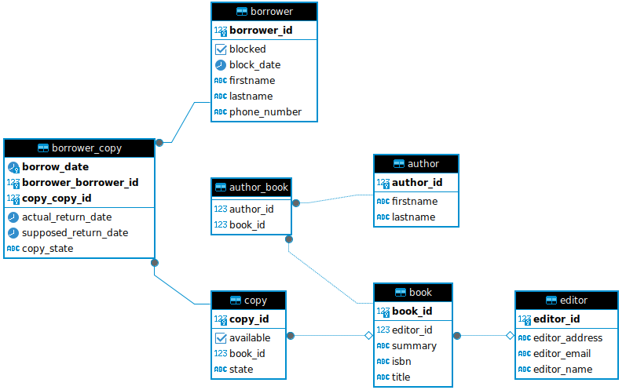

# Library management system
## Introduction
The library management system is designed to manage the operations of a library. The system maintains records of the borrowers, copies of books and the borrowing transactions in compliance with the policies of a particular library

## Table of contents
- [Database schema](#Schema)
- [Used Technologies](#Technologies)
- [Prerequisites](#Prerequisites)
- [Installation](#Installation)
- [Endpoints](#Endpoints)

## Schema


## Technologies
- Java
- Spring boot
- Spring jpa
- Hibernate
- Maven

## Prerequisites
- Java 8 or higher
- Postgresql database
- Postman (to interact with the api)

## Installation
- Clone the repository:
```git clone https://github.com/abb-ah-houdaifa/library-management-system.git```
- Configure `application.properties` file
- Build the project:
```mvn clean install```
- Run the application:
```mvn spring-boot:run```

The application will start by default on `http://localhost:8080`

## Endpoints
### BorrowersController Endpoints
- **GET /borrowers**: Fetch all the borrowers
- **GET /borrowers/search**: Fetch borrowers by first name and last name
- **GET /borrowers/{borrowerId}**: Fetch a borrower by ID
- **GET /borrowers/{borrowerId}/borrow-history**: Fetch borrow history for a borrower by ID
- **POST /borrowers/add**: Add a new borrower
- **PUT /borrowers/block/{borrowerId}**: Block a borrower by ID
- **PUT /borrowers/unblock/{borrowerId}**: Unblock a borrower by ID
### AuthorsController Endpoints
- **GET /authors**: Fetch all the authors
- **GET /authors/{authorId}**: Fetch an author by ID
- **POST /authors**: Add a new author
- **PUT /authors/{authorId}**: Update an existing author by ID
### EditorsController Endpoints
- **GET /editors**: Fetch all the editors
- **GET /editors/{editorId}**: Fetch an editor by ID
- **POST /editors**: Add a new editor
- **PUT /editors/{editorId}**: Update an existing editor by ID
### BooksController Endpoints
- **GET /books**: Fetch all the books
- **GET /books/{bookId}**: Fetch a book by ID
- **POST /books**: Add a new book
- **PUT /books/{bookId}**: Update an existing book by ID
### CopyController Endpoints
- **GET /copies**: Fetch all the copies
- **GET /copies/{copyId}**: Fetch a copy by ID
- **POST /copies**: Add a new copy
- **PUT /copies/{copyId}**: Update an existing copy by ID
- **DELETE /copies/{copyId}**: Delete a copy by ID
- **GET /copies/{copyId}/borrow-history**: Fetch borrow history for a copy by ID
### BorrowerCopyController Endpoints
- **POST /borrower/copy/borrow-copy**: Borrow a book copy
- **POST /borrower/copy/return-copy**: Return a borrowed book copy
